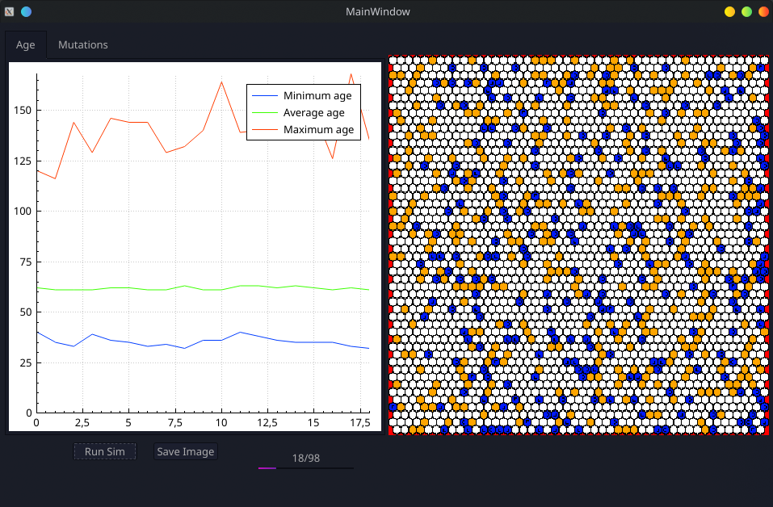

# xxSimulator | Unnamed simulation project

## Purpose
Recreate the process of evolution in a "game-style turn-based" simulation. Evolutionary development of creatures is made possible by an algorithm called [NEAT](http://nn.cs.utexas.edu/downloads/papers/stanley.ec02.pdf).

## Running
Since development is in its early days, provided version is not fully tested and possibly will not run on all systems (development is done on Manjaro Linux). Unfortunately support for any problems can not be promised at this stage. You may still post them on the issues to help the project.

Requires Qt

Build with cmake
```
git clone
cd xxSimulator
mkdir build
cd build
cmake ../ 
make
```

## Features
- 2D hexagon tilemap
- Creatures (currently only herbivores) have capability to move, stay or eat
- Creatures have sensory input for 
  - distance/direction of nearby plants
  - their current energy level
  - movement they have left
- Natural selection
  - Longest surviving creatures are copied over and have a chance to mutate (NEAT)
  - Other functions for fitness/selection are considered but not yet implemented



## Third party mentions
- [QCustomPlot](https://www.qcustomplot.com/) is used to draw the graphs and provided within the project. See their license.
- This project was inspired by 
  - biosim4 [GitHub](https://github.com/davidrmiller/biosim4)|[YouTube](https://www.youtube.com/watch?v=N3tRFayqVtk)
  - The Bibites: Digital Life [YouTube](https://www.youtube.com/c/TheBibitesDigitalLife/videos).